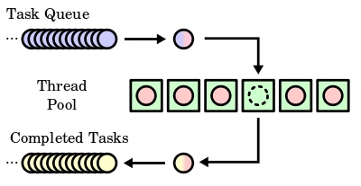

启动优化中，尽量能不在主线程就不在主线程。放到子线程又尽量不要同事并发，挨个来，给主线程多一些执行机会。那么一种方法是使用线程池。

<!-- more -->


# 介绍

这是Wikipedia上的定义：

> In computer programming, a thread pool is a software design pattern for achieving concurrency of execution in a computer program. Often also called a replicated workers or worker-crew model,[1] a thread pool maintains multiple threads waiting for tasks to be allocated for concurrent execution by the supervising program. By maintaining a pool of threads, the model increases performance and avoids latency in execution due to frequent creation and destruction of threads for short-lived tasks.[2] The number of available threads is tuned to the computing resources available to the program, such as parallel processors, cores, memory, and network sockets.[3]


> 一种线程使用模式。线程过多会带来调度开销，进而影响缓存局部性和整体性能。而线程池维护着多个线程，等待着监督管理者分配可并发执行的任务。这避免了在处理短时间任务时创建与销毁线程的代价。线程池不仅能够保证内核的充分利用，还能防止过分调度。可用线程数量应该取决于可用的并发处理器、处理器内核、内存、网络sockets等的数量。 例如，线程数一般取cpu数量+2比较合适，线程数过多会导致额外的线程切换开销。

- 英文 <https://en.wikipedia.org/wiki/Thread_pool>
- 中文 <https://zh.wikipedia.org/wiki/%E7%BA%BF%E7%A8%8B%E6%B1%A0>


如图：




# 实现

这篇2012年的文章 <http://progsch.net/wordpress/?p=81> 讲了一种简单的实现，是使用 C++11 实现的。下面的实现在这篇文章的代码上稍微进行了一点优化。

直接放代码了。


*ThreadPool.h*

```

#include <thread>
#include <mutex>
#include <condition_variable>
#include <queue>

class ThreadPool {
public:
    ThreadPool(size_t);
    template<class F>
    void enqueue(F f);
    ~ThreadPool();
private:
    void Task();

    // need to keep track of threads so we can join them
    std::vector< std::thread > workers;
    
    // the task queue
    std::deque< std::function<void()> > tasks;
    
    // synchronization
    std::mutex queue_mutex;
    std::condition_variable condition;
    bool stop;
};

// add new work item to the pool
template<class F>
void ThreadPool::enqueue(F f)
{
    { // acquire lock
        std::unique_lock<std::mutex> lock(queue_mutex);
        
        // add the task
        tasks.push_back(std::function<void()>(f));
    } // release lock
    
    // wake up one thread
    condition.notify_one();
}

```

*ThreadPool.mm*


```

#import "ThreadPool.h"

void ThreadPool::Task()
{
    std::function<void()> task;
    while(true)
    {
        {   // acquire lock
            std::unique_lock<std::mutex>
            lock(this->queue_mutex);
            
            // look for a work item
            while(!this->stop && this->tasks.empty())
            { // if there are none wait for notification
                this->condition.wait(lock);
            }
            
            if(this->stop) // exit if the pool is stopped
                return;
            
            // get the task from the queue
            task = this->tasks.front();
            this->tasks.pop_front();
            
        }   // release lock
        
        // execute the task
        task();
    }
}
// the constructor just launches some amount of workers
ThreadPool::ThreadPool(size_t threads)
:   stop(false)
{
    for(size_t i = 0;i<threads;++i){
        workers.push_back(std::thread([this]{this->Task();}));
    }
}

// the destructor joins all threads
ThreadPool::~ThreadPool()
{
    // stop all threads
    stop = true;
    condition.notify_all();
    
    // join them
    for(size_t i = 0;i<workers.size();++i){
        workers[i].join();
    }
}

```


# 使用方法


```
    ThreadPool pool(2);
    pool.enqueue([]{
        // todo: workload
    });
    
```


测试代码如下：

```
    static ThreadPool pool(2);

    NSInteger idx = 0;
    pool.enqueue([idx]{ NSLog(@"begin%@",@(idx)); sleep(arc4random() % 10); NSLog(@"end%@",@(idx)); }); idx++;
    pool.enqueue([idx]{ NSLog(@"begin%@",@(idx)); sleep(arc4random() % 10); NSLog(@"end%@",@(idx)); }); idx++;
    pool.enqueue([idx]{ NSLog(@"begin%@",@(idx)); sleep(arc4random() % 10); NSLog(@"end%@",@(idx)); }); idx++;
    pool.enqueue([idx]{ NSLog(@"begin%@",@(idx)); sleep(arc4random() % 10); NSLog(@"end%@",@(idx)); }); idx++;
    pool.enqueue([idx]{ NSLog(@"begin%@",@(idx)); sleep(arc4random() % 10); NSLog(@"end%@",@(idx)); }); idx++;
    pool.enqueue([idx]{ NSLog(@"begin%@",@(idx)); sleep(arc4random() % 10); NSLog(@"end%@",@(idx)); }); idx++;
    pool.enqueue([idx]{ NSLog(@"begin%@",@(idx)); sleep(arc4random() % 10); NSLog(@"end%@",@(idx)); }); idx++;
    pool.enqueue([idx]{ NSLog(@"begin%@",@(idx)); sleep(arc4random() % 10); NSLog(@"end%@",@(idx)); }); idx++;

```


# 其他


iOS上有多种线程创建方法，上面只是一种C++的实现。GitHub还有其他简单的实现：

- <https://github.com/nbsdx/ThreadPool>
- <https://github.com/tghosgor/threadpool11>


晚安 Smile

